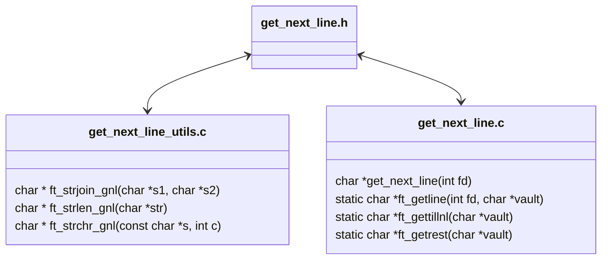
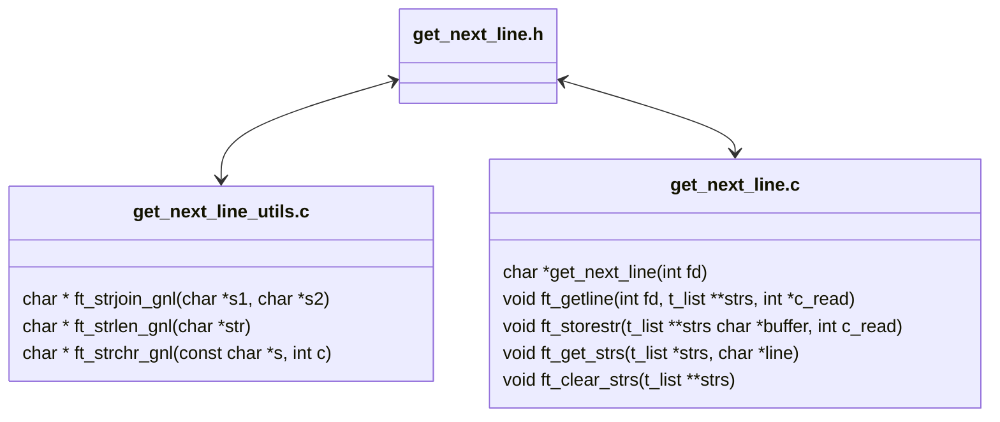

<a name="readme-top"></a>
<div align="center">

# get_next_line

> Because reading a line from a `fd` is way too tedious. 😪

<p>
    
    
    
    
    
</p>

___

<h3>Table o'Contents</h3>
<p>
    ~
    <a href="#about-pushpin">About</a> ~
    <a href="#usage-checkered_flag">Usage</a> ~
    <a href="#implementation-scroll">Implementation</a> ~
    <a href="#structure-construction">Structure</a> ~
    <a href="#debugging-beetle">Debugging</a> ~
    <a href="#license">License</a> ~
</p>
<div/>

<div align="left">

# About :pushpin:

`get_next_line` is a [42 Common Core](https://github.com/PedroZappa/42_CommonCore) project that delves into how `static variables` and `file descriptors` work. It is a challenge on `memory allocation`. 


---

# Usage :checkered_flag:

0. Clone repository & enter directory:

```sh
	git clone https://github.com/PedroZappa/get_next_line.git zedro-gnl
	cd zedro-gnl
```

> [!NOTE]
> Two distinct implementation can be found in this repository: the one on `srcll` implements `Linked Lists` without the bonus; while the other on `srcb` uses `Arrays` and meets both mandatory and bonus requirements. 

___

1. Compile mandatory with `Arrays` 🗂:

```sh
cc main.c srcb/get_next_line.c srcb/get_next_line_utils.c
```

2. Compile bonus with `Arrays` 🗂:

```sh
cc main.c srcb/get_next_line_bonus.c srcb/get_next_line_utils_bonus.c
```

3. Compile mandatory with `Linked Lists` 🔗:

```sh
cc main.c srcll/get_next_line.c srcll/get_next_line_utils.c
```

> [!IMPORTANT]
> The Linked Lists implementation is not mandatory. It was my first attempt at this project but it doesn't pass `The Norm`. 
> It seems impossible to solve this challenge using `Linked Lists`, avoiding memory leaks and following [norminette](https://github.com/42School/norminette)'s rules simultaneously.
> Additionally it passes all but one of [francinette](https://github.com/xicodomingues/francinette)'s tests.
___

# Implementation :scroll:

## Mandatory Requirements

`get_next_line` must:
- Return the contents of a line per function call read from a given `file descriptor`, until the end of the file is reached. 
- it must be implemented so that it handles any `BUFFER_SIZE` defined at compile time. 

## Bonus Requirements

- Must use only one `static` variable.
- The function must be able to handle multiple file descriptors appropriately.
- Each function call should be able to read from different `fd` without loosing track of partial lines read into its `static` buffer. 

___

# Structure :construction:

### Mandatory & Bonus w/ Arrays: Files and Functions 🗂



___

### Mandatory w/ Linked Lists: Files and Functions 🔗



___


# Debugging :beetle:

Within each implementation folder there is a `.gdbinit` file defining commands to quickly display relevant debug info customized for each implementation. `trace-commands` and `logging` is turned on to save `gdb`'s output into a `gdb.txt` file.

___

### Debugging `get_next_line` with `Arrays`

1. Compile `get_next_line` with `Arrays` with the `-g` flag:

```sh
cd srcb
cc -g ../main.c get_next_line.c get_next_line_utils.c
```

2. Open another terminal instance and fire up `valgrind` with the flag `--vgdb-error=0` to prepare a link to a `gdb` session: 

```sh
valgrind -q --vgdb-error=0 ./a.out
```

3. On the first terminal, run `gdb` with the `--tui` flag:

> The `.gdbinit` will automatically run the command `target remote | vgdb` connecting the current `gdb` instance with `valgrind`. Additionally custom debugging commands will be loaded to quickly display relevant debugging information.

```sh
gdb --tui ./a.out
```

4. On a third terminal instance run `tail` with the `-f` flag, which will keep track and print to the screen `gdb`'s output:

```sh
tail -f gdb.txt
```

5. To investigate the state of the memory  at any point of execution of the program run the custom command `mchk`:

> This command is an alias for `monitor leak_check full reachable any` 

```sh
(gdb) mchk
```


___

<div/>

<div align="center">

### License :copyright:

This work is published under the terms of <a href="https://github.com/PedroZappa/ft_printf/blob/master/LICENSE">42 Unlicense</a>.

<p align="right">(<a href="#readme-top">get to top</a>)</p>

<div/>
