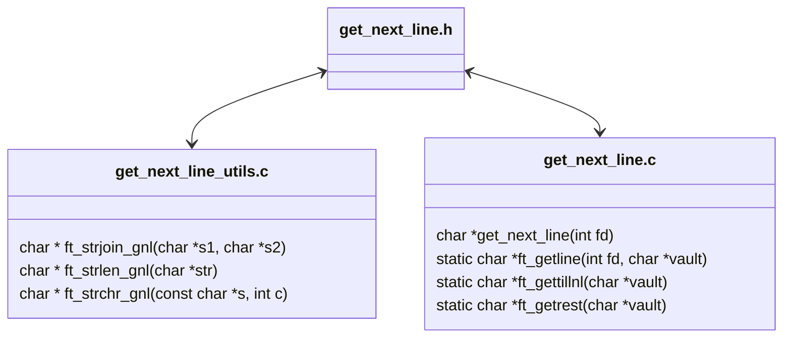
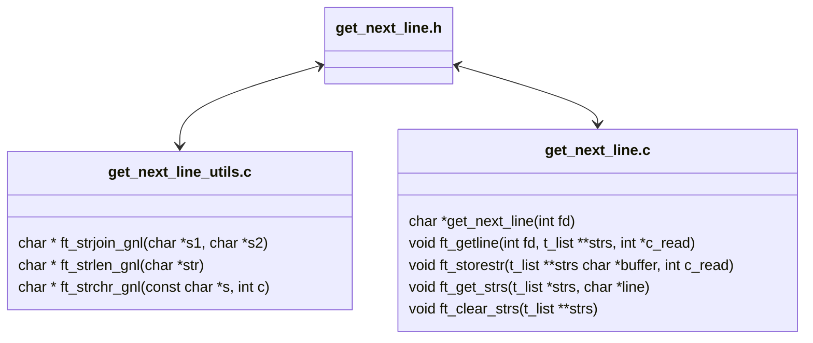

<a name="readme-top"></a>
<div align="center">

# get_next_line

> Because reading a line from a `fd` is way too tedious. 😪

<p>
    
    
    
    
    
</p>

<div/>
___

<h3>Table o'Contents</h3>

<!-- mtoc-start -->

* [About :pushpin:](#about-pushpin)
* [Implementation :scroll:](#implementation-scroll)
* [Mandatory Requirements](#mandatory-requirements)
* [Bonus Requirements](#bonus-requirements)
* [Structure :construction:](#structure-construction)
* [Mandatory & Bonus w/ Arrays: Files and Functions 🗂](#mandatory--bonus-w-arrays-files-and-functions-)
* [Mandatory w/ Linked Lists: Files and Functions 🔗](#mandatory-w-linked-lists-files-and-functions-)
* [Usage :checkered_flag:](#usage-checkered_flag)
* [Debugging :beetle:](#debugging-beetle)
* [Debugging `get_next_line`](#debugging-get_next_line)
  * [Happy Debugging! 🐛](#happy-debugging-)
  * [License :copyright:](#license-copyright)

<!-- mtoc-end -->

# About :pushpin:

`get_next_line` is a [42 Common Core](https://github.com/PedroZappa/42_CommonCore) project that delves into how `static variables` and `file descriptors` work. It is a challenging introduction to `memory allocation`. 


<div align="left">

___

# Implementation :scroll:

## Mandatory Requirements

`get_next_line` must:
- Return the contents of a line per function call read from a given `file descriptor`, until the end of the file is reached. 
- it must be implemented so that it handles any `BUFFER_SIZE` defined at compile time. 

## Bonus Requirements

- Must use only one `static` variable.
- The function must be able to handle multiple file descriptors appropriately.
- Each function call should be able to read from different `fd` without loosing track of partial lines read into its `static` buffer. 

___

# Structure :construction:

### Mandatory & Bonus w/ Arrays: Files and Functions 🗂



___

## Mandatory w/ Linked Lists: Files and Functions 🔗



---

# Usage :checkered_flag:

0. Clone repository & enter directory:

```sh
git clone https://github.com/PedroZappa/42_get_next_line.git zedro-gnl
cd zedro-gnl
```

> [!Note]
> 
> Two distinct implementation can be found in this repository: the one on `srcll` implements `Linked Lists` without the bonus; while the other on `srcb` uses `Arrays` and meets both mandatory and bonus requirements. 

___

0. To check all the available commands:

```sh
make help
```

1. Compile mandatory with `Arrays` 🗂:

```sh
make
```

2. Compile bonus with `Arrays` 🗂:

```sh
make bonus
```

3. Compile mandatory with `Linked Lists` 🔗:

```sh
make extrall
```

> [!Important]
> 
> The `Linked Lists` implementation does not fully pass [norminette](https://github.com/42School/norminette)'s tests. It was my first attempt at this project, I decided to keep it for future reference on handling `Linked Lists`. 
> It seems impossible to solve this challenge using `Linked Lists` taking the appropriate precautions to avoid memory leaks while adhering to `The Norm`.

___


# Debugging :beetle:

Within each implementation folder there is a `.gdbinit` file defining commands to quickly display relevant debug info customized for each implementation. `trace-commands` and `logging` is turned on to save `gdb`'s output into a `gdb.txt` file that we can track in real time with the command `tail` for a better debugging experience.

> [!NOTE]
>
> For user convenience the `make` command will copy the `.gdbinit` file related to the selected implementation into the root of the project.

___

### Debugging `get_next_line`

0. In your home directory, create a `.gdbinit` file with the following content:

```.gdbinit
set auto-load safe-path /
```

> This command is used to set the directories from which `gdb` can automatically load files.
> When `gdb` starts it reads commands from several initialization files, `.gdbinit` being one of them, it defines the commands to be automatically executed at the start of a `gdb` session.

> [!Important]
> Do this step only if you trust all the contents of the system you're working on, otherwise change `/` to the path of the folder you cloned this repo to.

1. Compile your chosen `get_next_line` implementation, for survey convenience the `-g` flag is called by default at compile time:

```sh
make
# or
make bonus 
# or
make extrall
```

2. Open another terminal instance and fire up `valgrind` and `vgdb` by running `valgrind` with the flag `--vgdb-error=0`: 

```sh
valgrind -q --vgdb-error=0 ./a.out
```

> `vgdb` is a small tool that allows `gdb` and `valgrind` to work together.

3. On the first terminal, run `gdb` with the `--tui` flag to launch `gdb` with a graphical user interface:

```sh
gdb --tui ./a.out <file>
```

4. On a third terminal instance run `tail` with the `-f` flag, which will keep track and print to the screen `gdb`'s output:

```sh
tail -f gdb.txt
```

5. To investigate the state of the memory  at any point of execution of the program run the custom command `mchk`:

```sh
(gdb) mchk
```

> This command is an alias for `monitor leak_check full reachable any` 

> [!Important]
>
> If you use `tmux` give `make gdb` and `make vgdb` rules a try 😉

___

#### Happy Debugging! 🐛

___

<div align="center">

### License :copyright:

This work is published under the terms of <a href="https://github.com/PedroZappa/ft_printf/blob/master/LICENSE">42 Unlicense</a>.

<p align="right">(<a href="#readme-top">get to top</a>)</p>

<div/>
